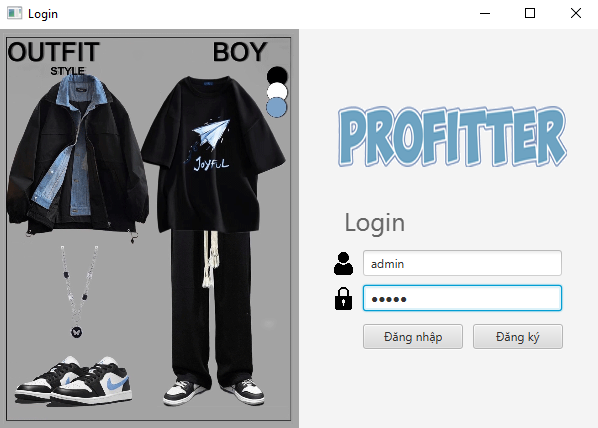
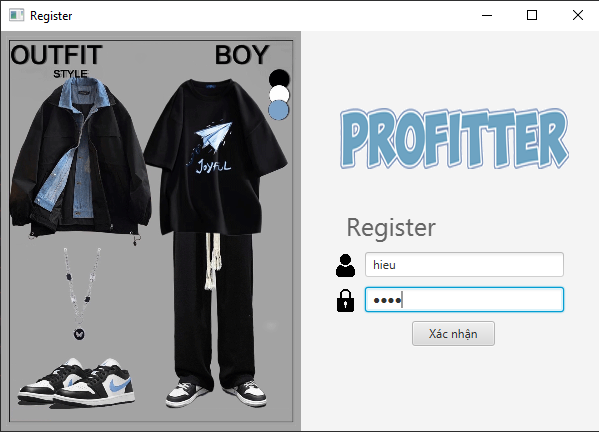
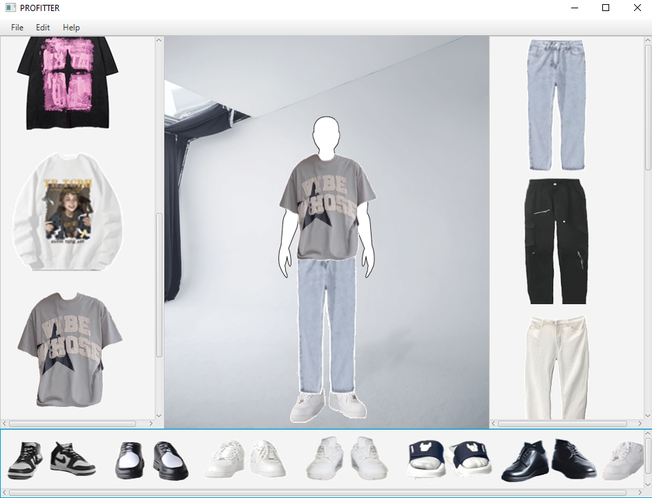
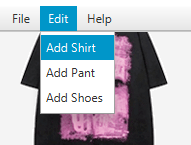
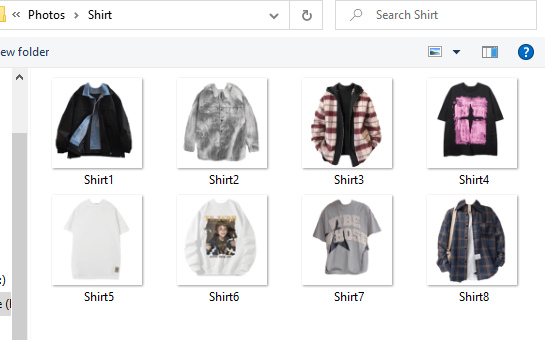
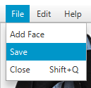

## 👔🩳 Ứng dụng thử đồ: ProFitter 🩳👔

👕👖👟 Ứng dụng thử đồ: ProFitter là 1 ứng dụng cho phép người dùng có thể tuỳ ý thêm các trang phục và phối chúng để tìm ra 1 bộ trang phục phù hợp với bản thân nhất.

## Authors

- [jinjja9](https://github.com/jinjja9)

## Demo

Link Video Demo: 
- [PROFITTER](https://www.youtube.com/watch?v=35dIQksqoZU)

## Screenshots









## Features

** Các chức năng chính của ứng dụng:**

+ Tích hợp chức năng đăng nhập, với tài khoản mặc định cho admin là admin/admin và cho user phải đăng ký mới có thể sử dụng.

+ Admin có khả năng thêm, chỉnh sửa các item quần áo trong hệ thống, cũng có thể phối trang phục như user.

+ Người dùng có thể lựa chọn, so sánh và kết hợp các món đồ với nhau để thử tông màu và phong cách, xem chúng có hợp nhau không (Có thể kéo thả trang phục để vừa với cơ thể)

+ Cho phép lưu các bộ phối đồ đã chọn thành 1 ảnh để tiện theo dõi và sử dụng lần sau


## Requirements

- Java 19
- Javafx 22

## Installation

Cách cài đặt dự án

```bash
  - Clone dự án
  - Thêm thư viện javafx vào module
  - Chạy ứng dụng tử class App.
```
